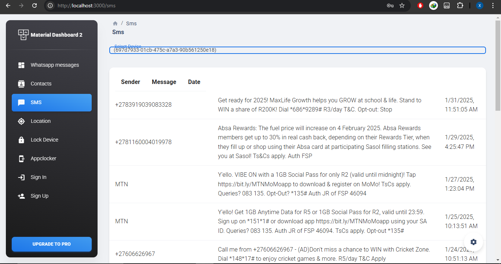
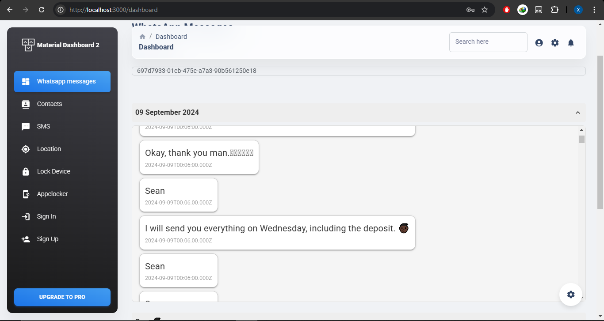
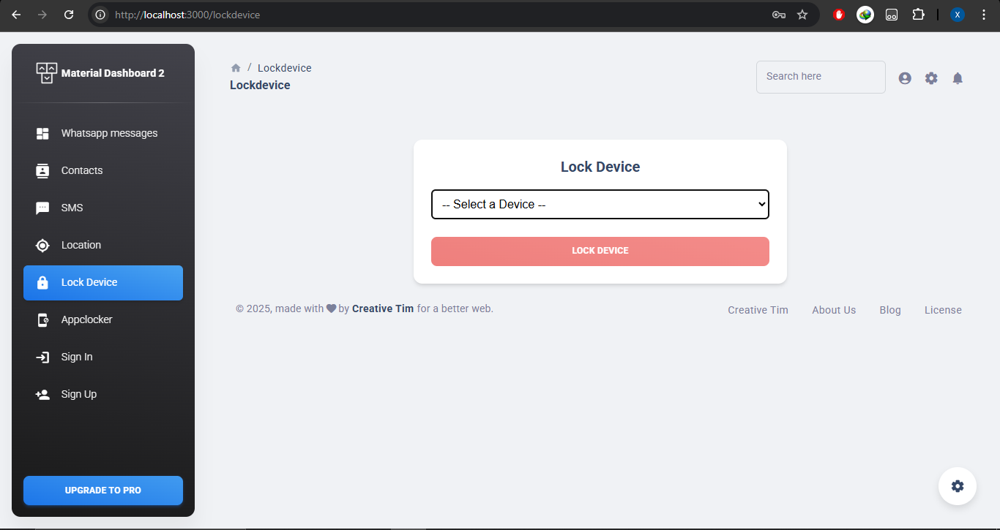
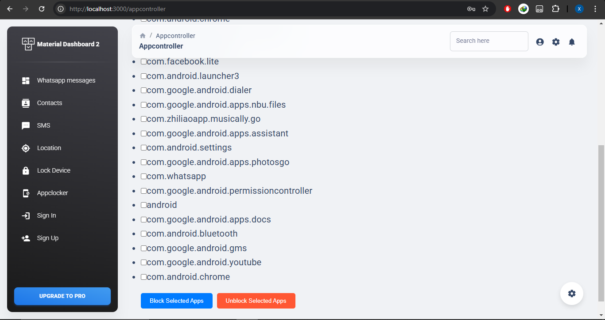
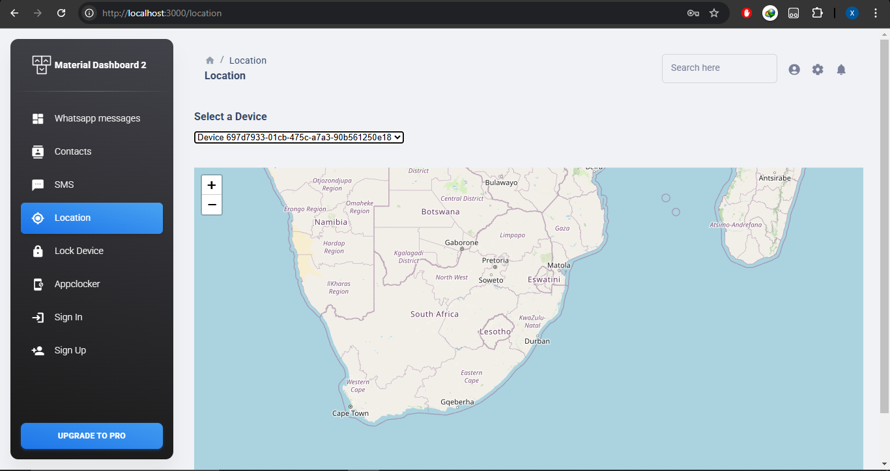
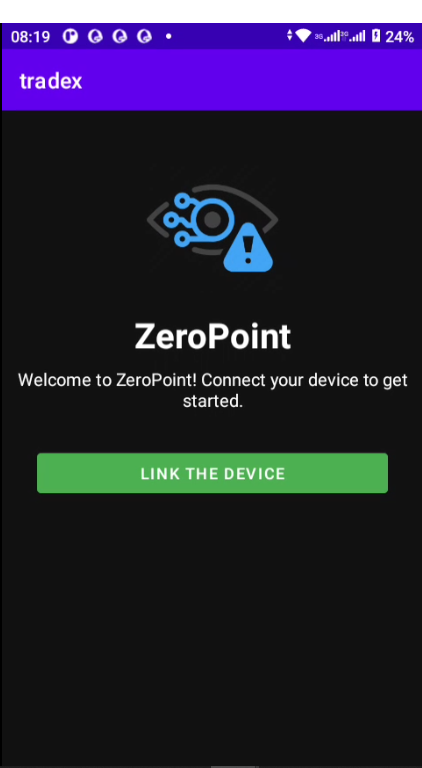

# Zero Point

## 🚀 Overview

Zero Point is an advanced monitoring system designed to stealthily track and manage Android devices. The mobile app runs discreetly in the background, collecting critical data such as contacts, SMS, call logs, and WhatsApp messages. Additionally, it allows remote actions like locking the device and blocking specific apps, as well as tracking the device’s location. The accompanying website displays all the collected information and provides remote control functionalities, ensuring a robust and comprehensive monitoring solution.

---

## 📱 Mobile App Features (Kotlin)

The mobile app is developed using Kotlin and operates in stealth mode to ensure uninterrupted monitoring. It securely collects and processes a range of data from the target device.

### **Key Features:**

- **Stealth Operation:**  
  The app runs in the background without alerting the user.

- **Data Collection:**  
  Seamlessly fetches:
  - Contacts and phone numbers
  - SMS messages  
    
  - Call logs
  - WhatsApp messages  
    

- **Remote Control:**  
  Provides functionalities to:
  - Lock the device remotely  
    
  - Block certain apps  
    

- **Location Tracking:**  
  Accurately tracks the device’s location.  
  

- **User Interface:**  
  A straightforward and intuitive interface for initial setup and monitoring overview.  
  

---

## 💻 Website Features (React JS & Express)

The Zero Point website is built using React JS for the front-end and a TypeScript (Express.js) backend. It offers a powerful dashboard for visualizing and managing the data collected from the mobile devices.

### **Key Features:**

- **Data Visualization:**  
  View detailed logs of SMS, call logs, WhatsApp messages, and contacts collected from the mobile device.

- **Remote Management:**  
  Control your device remotely:
  - Lock the device
  - Block or unblock apps

- **Location Mapping:**  
  Access real-time location tracking on an interactive map.

- **Seamless Integration:**  
  The website synchronizes effortlessly with the mobile app to ensure timely updates and efficient monitoring.

---

## 🔧 Tech Stack

- **Mobile App:** Kotlin
- **Website Front-End:** React JS
- **Backend:** TypeScript (Express.js)

---

## 📜 License

This project is proprietary. All rights are reserved. No modifications, redistribution, or commercial use is permitted without prior authorization from the project owner.
